# SailPoint Identity Security Cloud (ISC) Neovim Plugin

A Neovim plugin for managing SailPoint Identity Security Cloud (formerly IdentityNow) resources directly from your editor. It offers a fast, efficient way to browse, edit, and manage tenants, sources, transforms, roles, and more.

I was motivated to create this plugin because I found no tool for Neovim equivalent to the [SailPoint ISC VS Code extension](https://github.com/yannick-beot-sp/vscode-sailpoint-identitynow).

## Features

- **Fast Resource Browser**: Telescope integration with background pre-fetching for instant resource previews.
- **Direct Editing**: Edit transforms, rules, sources, and profiles as native JSON buffers.
- **Smart Sync**: Auto-detects **Create**, **Update**, or **Patch** operations upon saving (`:w`).
- **Debugging Suite**: Internal commands (`:SPI*`) for raw API access, VA cluster connectivity diagnostics, and dry-runs.
- **Secure Storage**: Personal Access Tokens (PAT) are stored via **keytar** (system keychain), ensuring credentials are never saved in plain text.

### Core Functionalities

- **Tenant Management**: Add, remove, and switch between multiple SailPoint Identity Security Cloud tenants.
- **Resource Editing**: View and edit Sources, Transforms, Roles, Access Profiles, Workflows, and Connector Rules directly in Neovim buffers.
- **Saving**: Detection of Create vs. Update vs. Patch (JSON Patch) operations based on resource type and state.
- **Caching**: Connection pooling and pre-fetching of resources for a responsive UI.
- **Developer Tools**: Dry-run capabilities to see raw API calls and JSON patch previews before committing changes.
- **Interactivity**: Integrated with Neovim's native input and list selection systems.

## Screenshots

<table>
  <tr>
    <td align="center">
      <b>:SetSail view</b><br>
      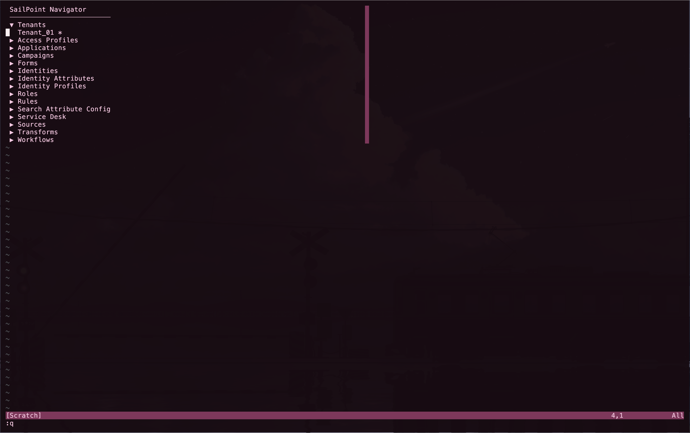<br>
    </td>
    <td align="center">
      <b>:SailPoint view</b><br>
      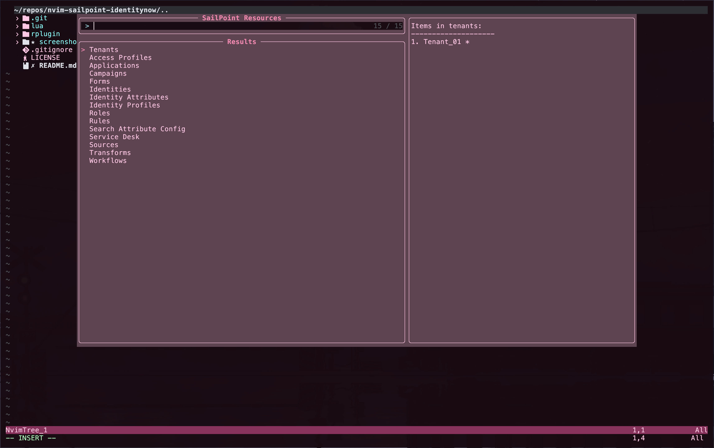<br>
    </td>
  </tr>
</table>

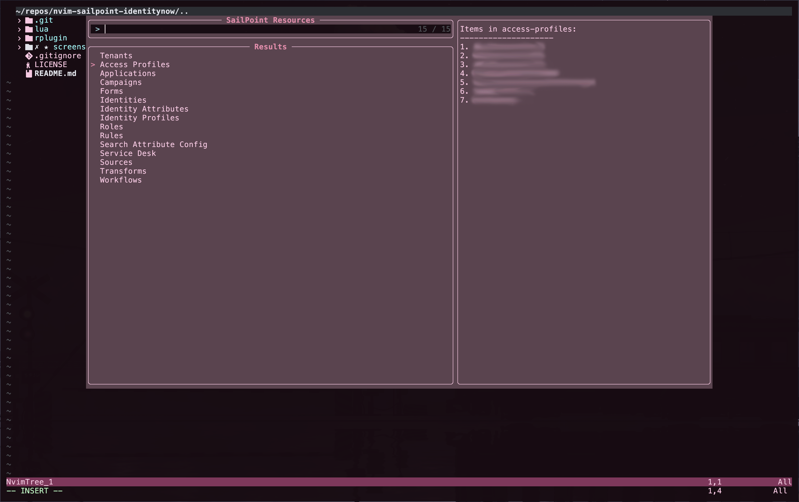
_View showing available access profiles for a registered tenant._


_View showing identities for a registered tenant._

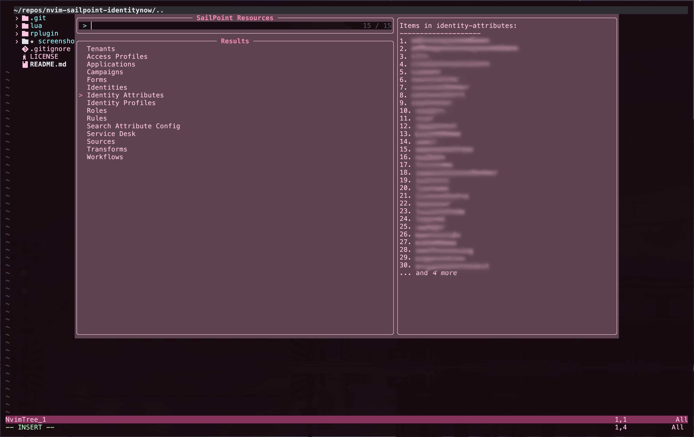
_View showing identity attributes._

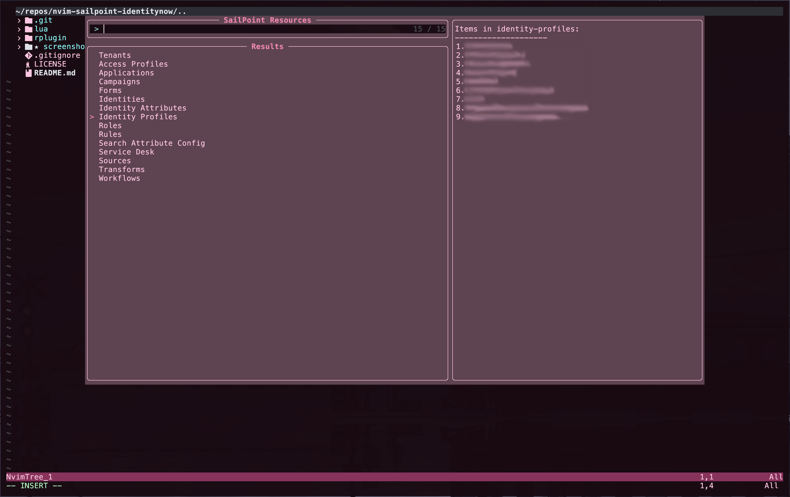
_View showing identity profiles._

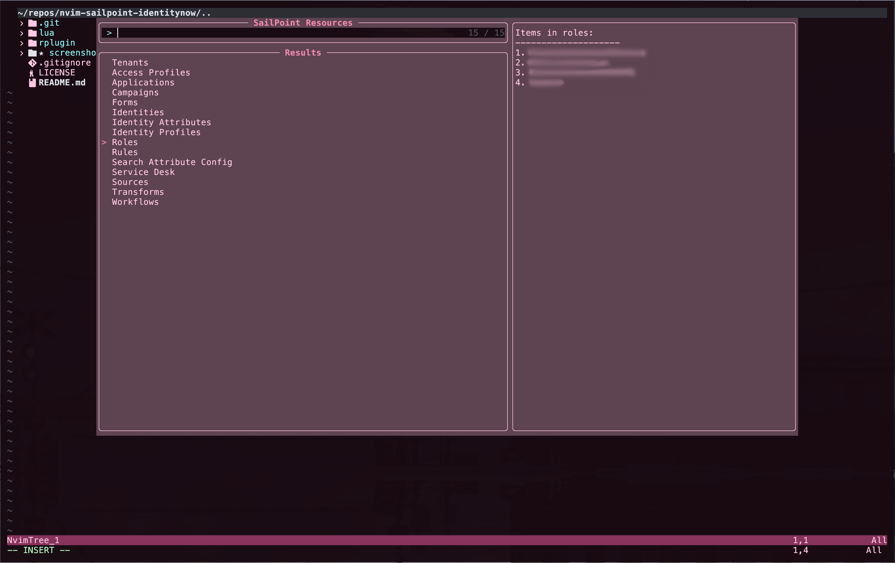
_View showing roles for a registered tenant._

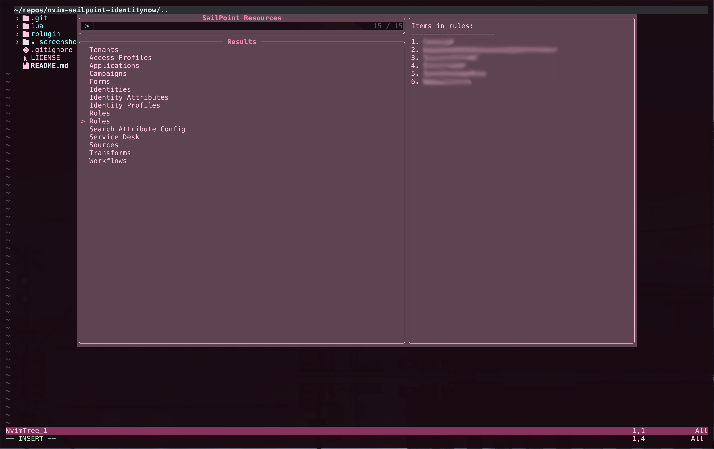
_View showing connector rules._

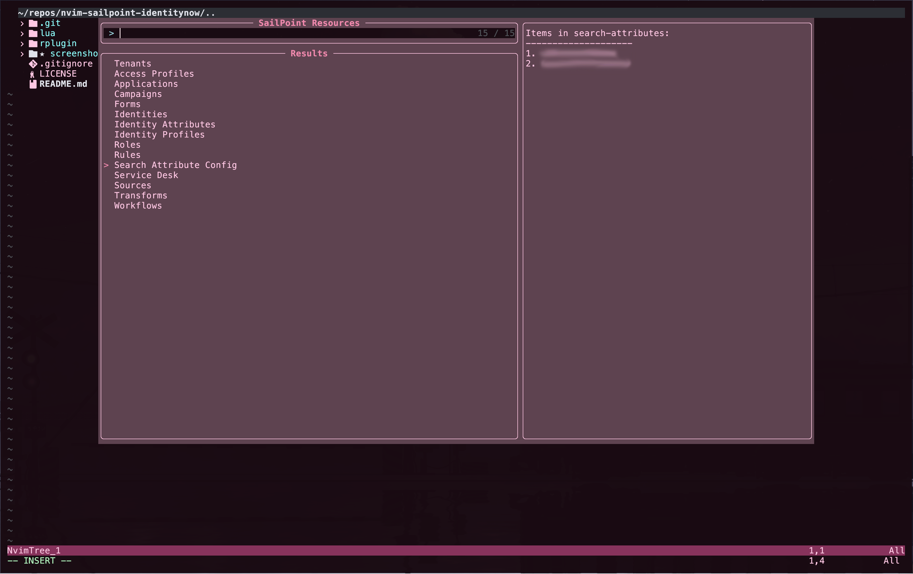
_View showing search attributes._

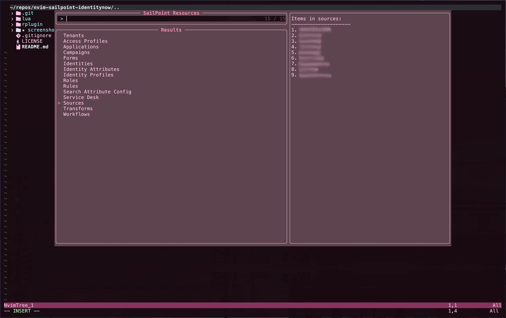
_View showing sources for a registered tenant._

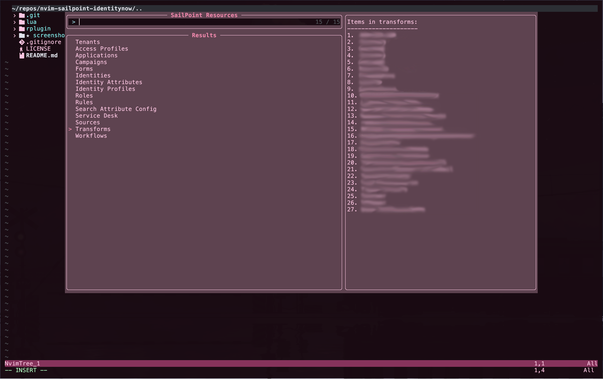
_View showing transforms for a registered tenant._

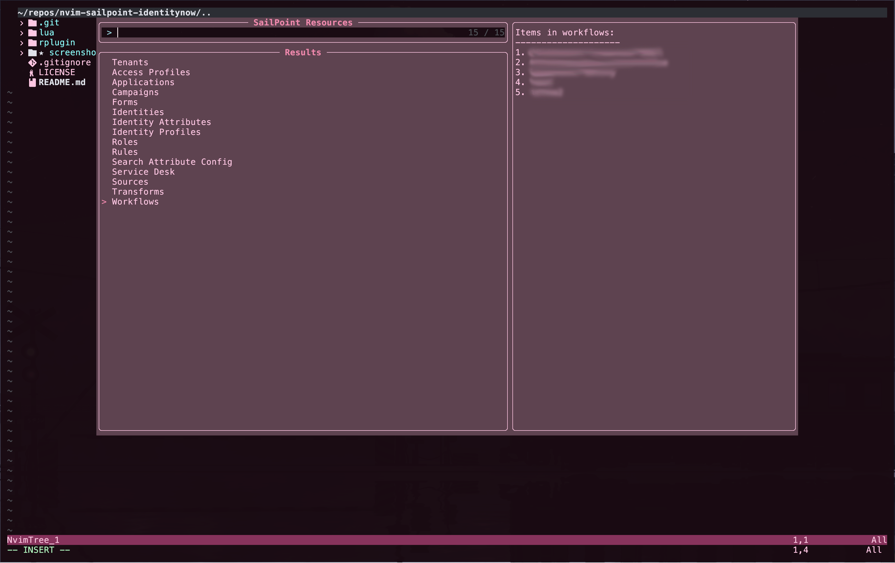
_View showing workflows for a registered tenant._

## Dependencies

### System Binaries

- **Node.js** (v16.x or newer)
- **npm** (for backend dependency management)

### Neovim Plugins Required

- [telescope.nvim](https://github.com/nvim-telescope/telescope.nvim)
- [plenary.nvim](https://github.com/nvim-lua/plenary.nvim)

## Installation

### Using `lazy.nvim`

```lua
{
    "yohanduartep/nvim-sailpoint-identitynow",
    dependencies = { "nvim-telescope/telescope.nvim", "nvim-lua/plenary.nvim" },
    build = ":SPIInstall",
    config = function()
        require("sailpoint").setup()
    end
}
```

### Manual Installation

- Clone the repository.
- Create a `nvim-sailpoint` folder under `~/.config` and insert the repository files there.
- Create a `sailpoint.lua` file under `~/.config/nvim/lua/your_user` directing to that folder, where the files will be set.

### Install dependencies:

    - Run :SPIInstall within Neovim.
    - Run :UpdateRemotePlugins.
    - Restart Neovim.

## Command Reference

### Core Commands

- `:SailPoint` : Open the main resource browser (Telescope).
- `:SetSail` : Open the comprehensive resource browser.
- `:SailPointAdd <type>` : Create a new resource (e.g., source, transform, role) or add a tenant.
- `:SailPointAggregate <source|entitlements> <id>` : Trigger account or entitlement aggregation.
- `:SailPointDelete <tenant|resource_path>` : Delete a tenant config or API resource.
- `:SailPointConfig <export|import> [path]` : Backup or restore tenant configurations.
- `:SailPointSave` (or `:w`) : Save current buffer to cloud.

### Utility and Documentation

- `:SailPointHelp` : Show command usage and examples.

### Debug and Advanced (SPI)

- `:SPIDebug` : Show active tenant, API version, and diagnostics.
- `:SPIRaw <path>` : Fetch and edit raw JSON from any API endpoint.
- `:SPIRemoveTenant <id>` : Remove a specific tenant configuration.
- `:SPIClone <type> <id> <newName>` : Clone a source or tenant.
- `:SPIDryRun` : Generate `curl` commands for the pending changes in the current buffer without executing them.
- `:SPIShowPatch` : Preview JSON Patch operations before saving.
- `:SPIPrefetchAll` : Force refresh the local resource cache.
- `:SPIPingCluster <id>` : Check Virtual Appliance (VA) cluster connectivity.
- `:SPIInstall` : Install necessary Node.js backend dependencies.

## Security

This plugin handles sensitive Personal Access Token (PAT) credentials. They are stored securely in your operating system's keychain (e.g., Windows Credential Manager, macOS Keychain, or libsecret on Linux) via **keytar**. This ensures your credentials are never stored in plain text on your file system.

---

## Changelog

### [0.0.2] - 2026-02-09

- **Unified Resource Architecture**: Centralized resource definitions in `resources.ts` to drive both backend logic and frontend UI.
- **Dynamic Lua Frontend**: Refactored the sidebar and Telescope pickers to load definitions dynamically from the TypeScript backend, eliminating drift.
- **Codebase Sanitization**: Purged unused utility modules redundant models to improve maintainability and performance.
- **Critical Bug Fixes**: Corrected `init.lua` command registration scoping and fixed URL/session generation in `SPIDryRun`.
- **Enhanced Error Handling**: Improved Axios interceptors for better error parsing and robust session lifecycle management.

### [0.0.1] - 2026-02-06

- Initial prototype featuring basic resource browsing, editing, and tenant management.

---

**Version v0.0.2**
