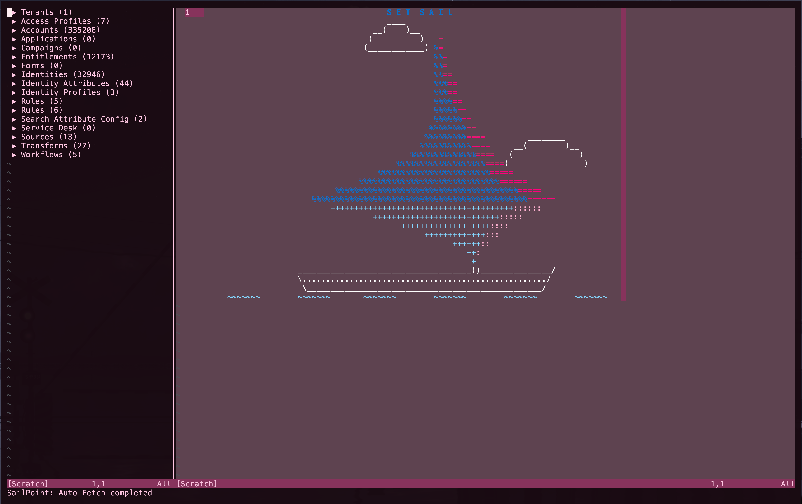

# SailPoint Identity Security Cloud (ISC) Neovim Plugin

A Neovim plugin for managing SailPoint Identity Security Cloud (formerly IdentityNow) resources directly from your editor. Browse, edit, and manage tenants, sources, transforms, roles, and more with a fast, efficient interface.

<div align="center">
  
</div>

Built as an alternative to the [SailPoint ISC VS Code extension](https://github.com/yannick-beot-sp/vscode-sailpoint-identitynow) for Neovim users.

## Features

- **Fast Resource Browser**: SetSail sidebar with cached resource loading and quick navigation
- **Direct Editing**: Edit transforms, rules, sources, and profiles as native JSON buffers
- **Smart Sync**: Auto-detects Create, Update, or Patch operations upon saving (`:w`)
- **Global Search**: Search across all resources with type-specific prefixes
- **Internal Commands**: Debug tools (`:SPI*`) for cache management and diagnostics
- **Secure Storage**: PAT credentials stored via keytar (system keychain)
- **Multi-Tenant Support**: Manage multiple SailPoint tenants simultaneously

### Core Functionalities

- **Tenant Management**: Add, remove, and switch between multiple tenants
- **Resource Editing**: View and edit Sources, Transforms, Roles, Access Profiles, Workflows, and Connector Rules
- **Intelligent Saving**: Automatic detection of Create vs Update vs Patch operations
- **Resource Caching**: Pre-fetching and caching for responsive UI
- **Developer Tools**: Dry-run capabilities with curl command generation
- **Interactive UI**: Expandable sidebar with search and filtering

## Quick Start

1. **Install the plugin** (see Installation section)
2. **Run** `:SPIInstall` to install backend dependencies
3. **Restart Neovim** and run `:UpdateRemotePlugins`
4. **Open sidebar** with `:SetSail`
5. **Add tenant** with `:SailPointAdd tenant`
6. **Browse resources** and start editing!

## Dependencies

### System Requirements

- **Node.js** v16.x or newer
- **npm** for backend dependency management
- **Neovim** 0.9.0 or newer

### Required Neovim Plugins

- [plenary.nvim](https://github.com/nvim-lua/plenary.nvim) - Lua utility functions (required)

## Installation

### Using `lazy.nvim` (Recommended)

```lua
{
    "yohanduartep/nvim-sailpoint-identitynow",
    dependencies = {
        "nvim-lua/plenary.nvim"
    },
    build = ":SPIInstall",
    config = function()
        require("sailpoint").setup({
            sidebar_width = 35,  -- Optional: width of sidebar (default: 35)
            sidebar_keymap = "<leader>tt"  -- Optional: keymap to toggle sidebar
        })
    end
}
```

### Using `packer.nvim`

```lua
use {
    "yohanduartep/nvim-sailpoint-identitynow",
    requires = {
        "nvim-lua/plenary.nvim"
    },
    run = ":SPIInstall",
    config = function()
        require("sailpoint").setup()
    end
}
```

### Manual Installation

1. Clone the repository to your Neovim config directory:

    ```bash
    git clone https://github.com/yohanduartep/nvim-sailpoint-identitynow.git \
        ~/.local/share/nvim/site/pack/plugins/start/nvim-sailpoint-identitynow
    ```

2. Install dependencies:

    ```vim
    :SPIInstall
    :UpdateRemotePlugins
    ```

3. Restart Neovim

4. Add to your `init.lua`:
    ```lua
    require("sailpoint").setup()
    ```

## Command Reference

### Primary Commands

- **`:SetSail`** - Open/toggle the SailPoint sidebar browser
- **`:SailPointSave`** (or `:w`) - Save current buffer to SailPoint cloud
- **`:SailPointHelp`** - Show command usage and examples
- **`:SailPointConfig`** - View/edit tenant configuration

### Resource Management

- **`:SailPointAdd <type>`** - Create a new resource (source, transform, role, etc.) or add tenant
- **`:SailPointAggregate <source|entitlements> <id>`** - Trigger aggregation
- **`:SailPointDelete <tenant|resource_path>`** - Delete tenant config or API resource

### Advanced Commands (SPI)

- **`:SPIDebug`** - Toggle debug mode and show active tenant/API version
- **`:SPIFetchAll`** - Manually fetch all resources (auto-runs on tenant add)
- **`:SPIRemoveTenant <id>`** - Remove specific tenant configuration
- **`:SPIInitCache`** - Reload cache from disk (useful after external changes)
- **`:SPIDebugCache`** - Show cache state for debugging
- **`:SPIDryRun`** - Generate curl commands for pending changes (no execution)
- **`:SPIShowPatch`** - Preview JSON Patch operations before saving
- **`:SPIInstall`** - Install Node.js backend dependencies

### Sidebar Keybindings

When in the sidebar:

- `<CR>` or `o` - Open selected resource or expand/collapse category
- `<Tab>` - Switch to selected tenant (when on tenant item)
- `s` - Launch search (searches across all resources, supports type prefixes)

## Usage Guide

### First-Time Setup

1. Open Neovim and run `:SetSail`
2. Add your first tenant:
    ```vim
    :SailPointAdd tenant
    ```
3. Enter tenant details when prompted:
    - **Friendly Name**: Display name (e.g., "Production")
    - **Tenant ID**: Your SailPoint tenant identifier
    - **Client ID**: Personal Access Token client ID
    - **Secret**: Personal Access Token client secret
    - **Domain**: API domain (default: `identitynow.com`)

4. API version is automatically detected and resources are fetched
5. Your credentials are securely stored in your system keychain
6. Resources appear in sidebar once fetch completes (~10-15 seconds)

### Browsing Resources

1. Open sidebar with `:SetSail`
2. Click categories to expand (Identities, Roles, Sources, etc.)
3. Click items to open them for editing
4. Use `s` in sidebar to launch global search

### Editing Resources

1. Open a resource from sidebar
2. Edit the JSON content
3. Save with `:w` or `:SailPointSave`
4. Plugin auto-detects if it's a Create, Update, or Patch operation

### Switching Tenants

1. Expand "Tenants" category in sidebar
2. Navigate to desired tenant
3. Press `<Tab>` to switch active tenant
4. Or press `<CR>` to view tenant details

### Global Search

1. Press `s` in sidebar to launch search
2. Type your search query with optional resource type prefix:
    - `identity john.doe` - Search identities for "john.doe"
    - `source Active Directory` - Search sources
    - `transform concatenate` - Search transforms
    - `role admin` - Search roles
    - Without prefix: searches all resource types
3. Available prefixes: `identity`, `source`, `role`, `accessprofile`, `entitlement`, `account`, `transform`, `workflow`, `app`, `rule`, `campaign`, `form`, `identity-attribute`, `identity-profile`, `search-attribute`, `service-desk`
4. Results grouped by resource type
5. Select result to open resource

#### Search Syntax

- **Field-specific search** (exact match): `field:value`
    - Example: `identityState:active` - Only matches "active", not "inactive"
    - When opening, cursor jumps to the matched field
    - Press `n`/`N` to navigate between matches in the buffer

- **General search** (contains match): `value`
    - Example: `active` - Matches "active", "inactive", "proactive", etc.
    - Searches across all fields in the resource

- **Wildcard search**: `*`
    - Matches all items of the specified type
    - Example: `identity *` - Lists all identities

- **Combined**: `<prefix> <field>:<value>`
    - Example: `identity identityState:active` - Search only identities with exact state match

## Security

This plugin handles sensitive Personal Access Token (PAT) credentials securely:

- Credentials stored in system keychain via **keytar**:
    - Windows: Credential Manager
    - macOS: Keychain
    - Linux: libsecret
- Never stored in plain text
- Never logged or exposed in error messages
- Automatic cleanup on tenant removal

## Configuration

The plugin accepts the following setup options:

```lua
require("sailpoint").setup({
    sidebar_width = 35,              -- Width of the sidebar (default: 35)
    sidebar_keymap = "<leader>tt"    -- Keymap to toggle sidebar (default: "<leader>tt")
})
```

### Advanced Configuration

- **Debug Mode**: Toggle verbose logging

    ```vim
    :SPIDebug  " Toggle on/off
    ```

    - Shows detailed fetch progress
    - Displays metadata availability
    - Useful for troubleshooting API issues

## Development

### Project Structure

```
nvim-sailpoint-identitynow/
├── lua/sailpoint/              # Lua frontend
│   ├── init/                   # Setup and initialization
│   ├── sidebar/                # Sidebar rendering and interaction
│   ├── ui/                     # UI components
│   │   └── window_manager.lua  # Window management
│   ├── state.lua               # State management with events
│   └── config.lua              # Config wrapper
└── rplugin/node/sailpoint/     # TypeScript backend
    └── src/
        ├── commands/           # Resource commands and fetchers
        ├── services/           # API clients and services
        ├── types/              # TypeScript type definitions
        ├── utils/              # Utility functions
        ├── resourceRegistry.ts # Resource definitions and policies
        └── vscode/             # VS Code compatibility shim
```

### Key Architectural Decisions

- **Lua handles**: UI, window management, user interactions
- **TypeScript handles**: API communication, data processing
- **Event-driven state**: All state changes emit events for reactivity

### Contributing

1. Fork the repository
2. Create a feature branch
3. Add tests for new functionality
4. Ensure all tests pass
5. Submit a pull request

---

## Changelog

### [0.0.3] - 2026-02-17

**Performance & Reliability**

- **Peak Velocity Fetch**: Optimized fetch pipeline with parallel batching (3x faster)
    - Accounts: 3 sources in parallel
    - Small resources: 8 simultaneous fetches
    - 5-minute cache TTL for instant subsequent fetches
- **Auto-Fetch**: Resources automatically fetch after tenant add
- **Smart Cache Loading**: Auto-loads cached resources on sidebar open (instant startup)
- **Lazy Background Fetch**: Only fetches modified resources or 24h+ old data

**User Experience**

- **Clean Progress Tracking**: Unified "Fetching... X/Y resources" counter
- **Search Completion**: Shows "Search complete - Found X results" message
- **Debug Mode**: Toggle verbose logging with `:SPIDebug`
- **Better Error Messages**: Clear feedback for 404s and API issues

**Technical Improvements**

- Smart cache-first approach (checks local before API)
- Timestamp-based cache freshness tracking
- Optimized progress display (no spam during parallel fetches)
- Improved error handling for transient vs permanent failures
- Fixed Command Errors: Resolved E5108 errors and function call issues
- Dead Code Cleanup: Removed unused init/ modules
- Cache Auto-Init: Integrated SPIInitCache and SPISmartLazyFetch commands

### [0.0.2] - 2026-02-15

- Eliminated monolithic files (sidebar, telescope, init)
- Implemented event-driven state management (state.lua)
- Consolidated window management into single module
- Improved IDE autocomplete and compile-time safety
- **SetSail as Single Entry**: `:SetSail` is now the single browser entrypoint
- **Window Routing Fixes**: Sidebar/editor open behavior hardened
- **Search Attribute Hardening**: Added empty-key guard and safer field matching

### [0.0.1] - 2026-02-09

- **Unified Resource Architecture**: Centralized resource definitions
- **Dynamic Lua Frontend**: Refactored sidebar and Telescope pickers
- **Codebase Sanitization**: Purged unused utility modules
- **Critical Bug Fixes**: Fixed command registration and URL generation
- **Enhanced Error Handling**: Improved Axios interceptors

### [0.0.0] - 2026-02-06

- Initial prototype featuring basic resource browsing, editing, and tenant management

---

**Current Version: v0.0.3**

## License

MIT License - See [LICENSE](LICENSE) file for details

## Acknowledgments

- Inspired by [SailPoint ISC VS Code extension](https://github.com/yannick-beot-sp/vscode-sailpoint-identitynow)
- Built with [plenary.nvim](https://github.com/nvim-lua/plenary.nvim)
